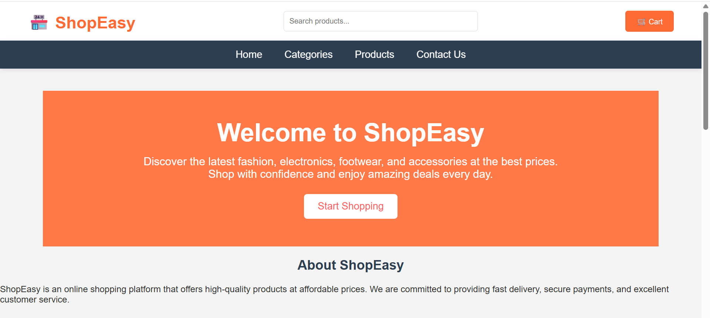
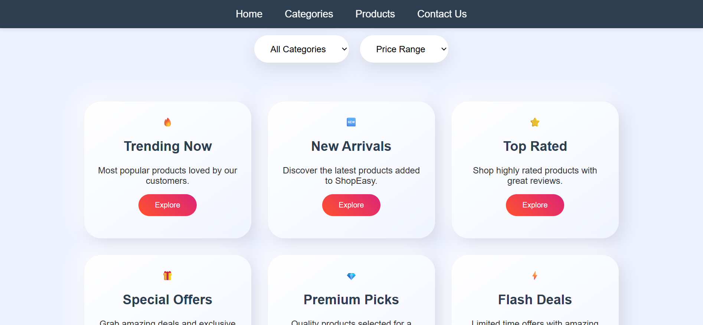
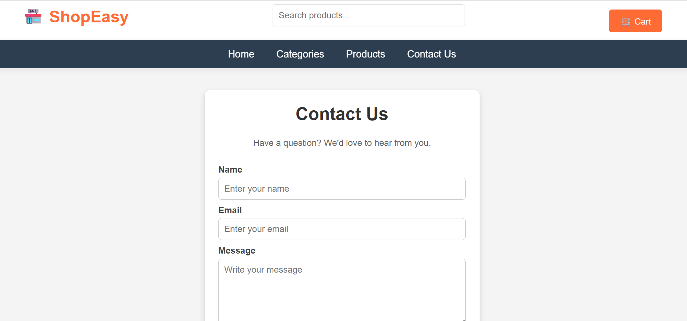
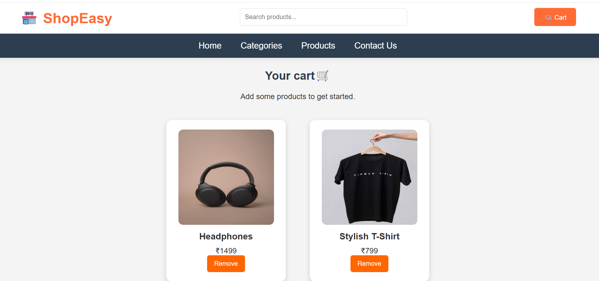

# E-Commerce Website

A simple e-commerce website built using HTML, CSS, JavaScript, Node.js, Express.js and MongoDB.

## Features
- Product listing
- Product search
- Add to cart functionality
- Contact form
- Backend using Node.js and Express.js
- MongoDB database integration
- User login functionality
- User signup functionality

## Technologies Used
- HTML5
- CSS3
- JavaScript
- Node.js
- Express.js
- MongoDB

## Project Setup

1. Install dependencies:
npm install

2. Run the server:
node app.js

3. Open in browser:
http://localhost:8000

## Screenshots

### Home Page

### Products Page

### Categories Page

### Contact Page

### Cart Page

### Login Page

### Signup Page

## Author
Basanti Meghwal